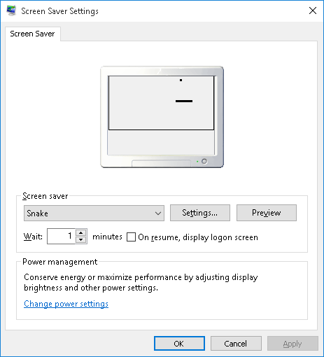
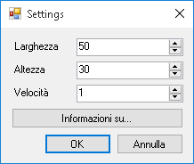
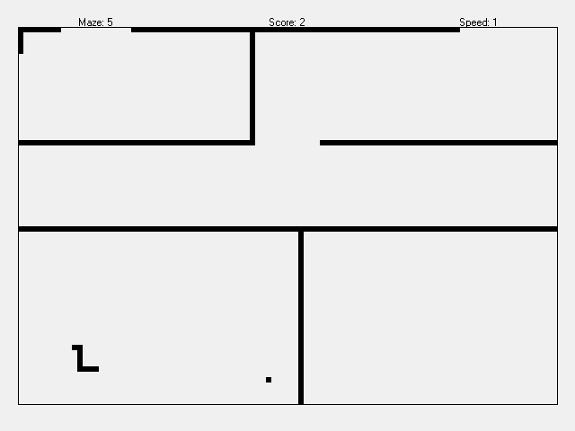

Snake screensaver
=================

Introduction
------------

The objective of [Snake](https://en.wikipedia.org/wiki/Snake_%28video_game_genre%29) is to make a snake eat as much food as possible without running into itself or obstacles in the field. The game becomes increasingly harder because every time the snake eats, it also grows in length.

This is a screensaver implementation based on Nokia 3310's Snake II.

It needs to be compiled in the same architecture as the OS (in case of x64 versions of Windows untick the option `Prefer 32 bit` in the building settings of the project), renamed with a `.scr` extension and saved in `C:/Windows/System32`.

For more informations about Windows Screensavers, see <https://github.com/HashakGik/Screensaver-C-sharp>.

The following are some screenshots:

Features
--------

- Speed, width and height of the playing field are fully customizable
- The playing field is scaled to fit the screen resolution
- After a game over, the game is restarted with a different maze
- Any user interaction (other than the arrow keys) closes the screensaver.

Remarks
-------

- The project is in a draft state, therefore the user interface is minimal (each element is displayed as a square).